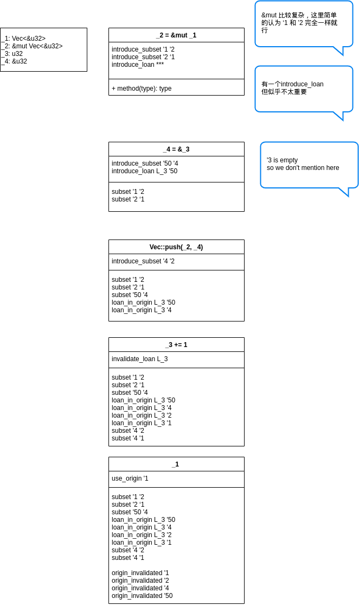

# Polonius.next

## When we generate subset

Most mir instruction will generate subset relations.

subset is everywhere.

|        |                     | subset | 
| :----- | :------------------ | :----- |
| Borrow | \_1 = &'3 \_2       |  '2<='3, '3<='1 |
| Move   | \_1 = move \_2      |   -             |
| Copy   | \_1 = \_2           |   '2<='1        | 
| Call   | Vec::push(\_1, \_2) |   '2<='1        |
|        |                     |                 |

## The necessity of propagation of subset(along Node)

a simple vec-push example is enough to explain:

```
_1: Vec<&u32>
_2: &mut Vec<&u32>
_3: u32
_4: &u32

_3 = 3
_2 = &mut _1
_4 = &_3
Vec::push(_2, _4)
_3 += 1
_1    // error

```



'1 -> '2 -> '4

缺少一个就无法检测错误，subset 关系必须一路传下来

## Improper subset causes problems

Some similar invariants: 

```rust
// version A
fn main() {
    let mut x: (&u32,) = (&22,);
    let mut y: &u32 = &33;
    let mut z = 44;
    y = x.0;
    x.0 = &z;  // clear_origin
    z += 1;
    y;
}
```

```rust
// vec version
fn bar() {
  let mut v = vec![];
  let a = 12;
  let mut b = 12;
  let mut x = (&a, 1);
  v.push(x);
  x.0 = &b;  // clear_origin
  b += 1;
  v;
}
```


```rust
// replace version
fn main() {
  let a = 1;
  let mut b = 2;

  let mut x = &a;

  let y = x;

  std::mem::replace(&mut x, &b);  // clear_origin ?
  b += 1;

  y;
}
```

|                 | x     | y         |
| --------------- | ----- | --------- |
| version A       | tuple | &u32      |
| vec version     | tuple | Vec<&u32> |
| replace version | &u32  | &u32      |


|                   |        | Call/Terminator               |
| ----------------- | ------ | ----------------------------- |
| 1. 构造subset x y | y=x.0  | Vec::push(y,x)                |
| 2. 修改x的指向    | x.0=&b | std::mem::replace(&mut x, &b) |
| 3. 访问y          |        |                               |


## How to solve?
`clear_origin`

TODO I feel `clear_origin` is enough. Why do we need `clear_loan`?

## Still a lot of problems

