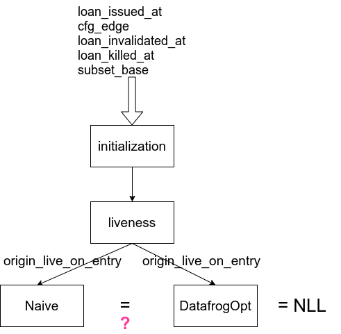

# **Use Abella to prove equivalence of datalog rules**

In Polonius (the new Rust borrow checker)

By YIJUN Leng 

---
# Borrow checker in Rust
```
#include<iostream>     
#include<vector>
using namespace std;

int main(){                          fn main() {            
  vector<int> v={12};                    let mut v=vec![12];
  auto x=&v[0];                          let x=&v[0];
  cout<<*x<<endl;                        dbg!(x);
                                     
  v.reserve(100);                        v.reserve(100);
  cout<<*x<<endl;                        dbg!(x);
}                                    }                       
```


---
# How nll borrow checker work
mutable borrow
immutable borrow

```
1 fn main() {            
2     let mut v=vec![12];
3     let x=&v[0];
4     dbg!(x);
5 
6     v.reserve(100);
7     dbg!(x);
8 }                       
```

---
# Desugared

```
1 fn main() {            
2     let mut v=vec![12];
3     let x=&v[0];
4     dbg!(x);
5 
6     Vec::reserve(&mut v, 100);
7     dbg!(x);
8 }                       
```

multiply immutable borrows / one mutable borrow 

mutable borrow: L6 
immutable borrow: L7 L6 L5 L4

---
# The problem of nll 

```rust
fn get_or_insert(
    map: &mut HashMap<u32, String>,
) -> &String {
    match map.get(&22) {
        Some(v) => v,
        None => {
            map.insert(22, String::from("hi"));
            &map[&22]
        }
    }
}
```

--- 

```
error[E0502]: cannot borrow `*map` as mutable because also borrowed as immutable
 --> src/main.rs:11:13
  |
3 |   map: &mut HashMap<u32, String>,
  |        - let's call the lifetime of this reference `'1`
4 | ) -> &String {
5 |   match map.get(&22) {
  |         --- immutable borrow occurs here
6 |     Some(v) => v,
  |                - returning this value requires `*map` is borrowed for `'1`
7 |     None => {
8 |       map.insert(22, String::from("hi"));
  |       ^^^^^^^^^^^^^^^^^^^^^^^^^^^^^^^^^^ mutable borrow occurs here
```

---

# Desugared 

```rust
fn get_or_insert<'a>(
    map: &'a mut HashMap<u32, String>,
) -> &'a String {
    match HashMap::get(&*map, &22) {
        Some(v) => v,
        None => {
            HashMap::insert(&mut *map, 22, String::from("hi"));
            &map[&22]
        }
    }
}
```
https://nikomatsakis.github.io/rust-belt-rust-2019/#72
https://www.youtube.com/watch?v=_agDeiWek8w&t=329s&ab_channel=RustBeltRustConference

---

# How Polonius work?

```rust
cargo  rustc  -- -Zpolonius
// or
rustc -Zpolonius main.rs 
```




---
In practise, naive = datafrog-opt.

Intuitively, naive = datafrog-opt.

But how do we formally prove it?

---
# Choose a proof assistant to prove naive = datafrog-opt

- Isabella
- Lean3 Lean4
- lambda prolog
    Teyjus
    ELPI（OCaml）
    **Abella（OCaml）**: suitable to express datalog

A lot of under developing...

--- 
# Steps
1. use Abella to describe datalog
1.1 input
1.2 naive and datafrog-opt
2. datafrog_opt_error => naive_error
3. naive_error => datafrog_opt_error

---
# 1. Use Abella to describe datalog
```
Kind origin type.
Kind loan type.
Kind point type.

Type origin_live_on_entry origin -> point -> prop.
Type loan_issued_at origin -> loan -> point -> prop.
Type cfg_edge point -> point -> prop.
Type loan_invalidated_at loan -> point -> prop.
Type not_loan_killed_at loan -> point -> prop.
Type subset_base origin -> origin -> point -> prop.
```

---

# 1. Use Abella to describe datalog
```
Define  naive_subset: origin -> origin -> point -> prop,
        naive_origin_contains_loan_on_entry: origin -> loan -> point -> prop,
        naive_loan_live_at: loan -> point -> prop,
        naive_errors: loan -> point -> prop  by

naive_subset Origin1  Origin2  Point  :=
  subset_base Origin1  Origin2  Point ;

naive_subset Origin1  Origin2  Point2  :=
  exists Point1,
  naive_subset Origin1  Origin2  Point1 /\
  cfg_edge Point1  Point2 /\
  origin_live_on_entry Origin1  Point2 /\
  origin_live_on_entry Origin2  Point2 ;
...
```

---
# 2. datafrog_opt_error => naive_error

```
Theorem DatafrogOpt2Naive:
  forall Loan,
  forall Point,
  datafrog_opt_errors Loan Point ->
  naive_errors Loan Point.
```

---
# Two important inspection

```
/* Lemma24 */
datafrog_opt_subset Origin1 Origin2 Point 
=> naive_subset Origin1 Origin2 Point

/* Lemma26 */
datafrog_origin_contain_loan_on_entry Origin Loan Point
=> naive_origin_contains_loan_on_entry Origin Loan Point
```

---
# Prove Lemma24

```
Theorem Lemma24:
  (
    forall Point,
    forall Origin1,
    forall Origin2,
    datafrog_opt_subset Origin1 Origin2 Point ->
    naive_subset Origin1 Origin2 Point
  ) /\ (
    forall Point1,
    forall Point2,
    forall Origin1,
    forall Origin2,
    dying_can_reach Origin1 Origin2 Point1 Point2  ->
    naive_subset Origin1 Origin2 Point1
  ).
```

---
# 3. naive_error => datafrog_opt_error

Can we follow the trick before?
```
/* Lemma25 */
naive_subset Origin1 Origin9 Point
=> datafrog_opt_subset Origin1 Origin9 Point 

/* Lemma27 */
naive_origin_contains_loan_on_entry Origin Loan Point
=> datafrog_origin_contain_loan_on_entry Origin Loan Point
```

**WRONG!**

--- 

```
/* Lemma25 */
naive_subset Origin1 Origin9 Point
=> datafrog_opt_subset Origin2 Origin9 Point 

/* Lemma27 */
naive_origin_contains_loan_on_entry Origin9 Loan Point
=> datafrog_origin_contain_loan_on_entry Origin2 Loan Point
```

**STILL WRONG!**

Definitely, it's not trival to construct meaningful relationship from naive to datafrog-opt.

---

# How to deal with the gap?

What if `naive_subset` is defined as ...
Not extensible along Point

```
Define  my_subset: origin -> origin -> point -> prop,
        my_origin_contains_loan_on_entry: origin -> loan -> point -> prop by

my_subset Origin1  Origin2  Point  :=
  datafrog_opt_subset Origin1  Origin2  Point ;

my_subset Origin1  Origin3  Point  :=
  exists Origin2,
  datafrog_opt_subset Origin1  Origin2  Point /\
  my_subset Origin2  Origin3  Point ;

my_origin_contains_loan_on_entry Origin Loan Point  :=
  datafrog_opt_origin_contains_loan_on_entry Origin Loan Point ;

my_origin_contains_loan_on_entry Origin2  Loan  Point  :=
  exists Origin1,
  my_origin_contains_loan_on_entry Origin1  Loan  Point /\
  datafrog_opt_subset Origin1  Origin2  Point .
```

---

# Redefine naive_* with datafrog_opt_*

my_origin_contain_loan_on_entry <=> naive_origin_contains_loan_on_entry 

my_subset <=> naive_subset


---
# Conclusion

We prove two algorithms in Polonius produce the same result, based on only one axiom.

## Main tactic

induction

--- 
# Benefit from this proof

We don't need to worry about the correctness of datafrog-opt any more.
Currently, we rely on a lot of tests to confirm the equivalence.

Helpful to verify new datalog rules.

---
# Future work
Catch up Polonius progress

Make Polonius the default borrow checker of Rust

---

# Why we need proof assistant?
- Repeatability
- Discover problem in proof

--- 

# Express negative in Abella

```
/* The only axiom introduced */
Theorem OriginLiveAxiom:                                                                                                    
  forall Origin,                                                                                                   
  forall Point,                                                                                                    
  (origin_live_on_entry Origin Point ) \/ ( origin_live_on_entry Origin Point -> false).                           
skip.
```
A function is the negative of fact!

```
H1: origin_live_on_entry Origin Point 
H2: origin_live_on_entry Origin Point -> false
```
We can use `search` tactic to get false quickly.
TODO: How to express three mutually exclusive states?

---

# Tricky things in Abella

Both true and false!
Abella will give a warning.

```
Define p : prop by
p := p -> false .

Theorem p_true : p .
unfold . intros . case H1 ( keep ) . apply H2 to H1 .

Theorem notp_true : p -> false .
intros . case H1 ( keep ) . apply H2 to H1 .
```

---

# Power of Abella
Abella is suitable to express datalog.

But we only utilize a little functionality in Abella here.

Coinduction, nable, pi calculas ...

---

# Polonius can't deal with 1
```
struct S;

fn main() {
    let s=S;
    let mut v:Vec<&S>=vec![];
    v.push(&s);
    v.pop();
    drop(s);
    // although v has remove the last element,
    // but still throw error
    v;
}
```

---

# Polonius can't deal with 2

```
use std::collections::binary_heap::BinaryHeap ;

fn main() {
    let mut heap = BinaryHeap::new();
    if let Some(_) = heap.peek_mut() {
        heap.push(4);
    };
}
```

THINKING: compare with P5

https://github.com/rust-lang/rust/issues/70797


---

# Datalog engines
1. swi(scala)

2. racket: 
https://docs.racket-lang.org/datalog/Tutorial.html
no negative？

3. souffle (c++): parallel. Rust is using

4. bddbddb (java): use binary decision diagram. Rely on NP problem.

5. https://github.com/vmware/differential-datalog
6. gnu-prolog gprolog (C)

---
# Datalog engines


---
# Q&A

Full proof here: 
https://github.com/lengyijun/polonius-abella
--- 
